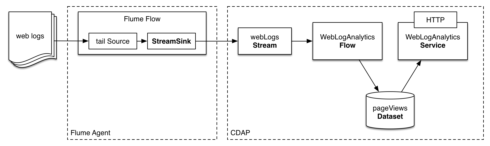

===========================================
Ingesting Data into CDAP using Apache Flume
===========================================

Ingesting realtime log data into Hadoop for analysis is a common use
case which can be solved with `Apache Flume <http://flume.apache.org/>`__.
In this guide, you will learn how to ingest data into CDAP with Apache
Flume and process it in realtime.

What You Will Build
===================

You will build a 
`CDAP application <http://docs.cdap.io/cdap/current/en/developers-manual/building-blocks/applications.html>`__
that uses web logs aggregated by Flume to find page view counts. You will:

- Configure Flume to ingest data into a 
  `CDAP Stream <http://docs.cdap.io/cdap/current/en/developers-manual/building-blocks/streams.html>`__;
- Build a realtime
  `Flow <http://docs.cdap.io/cdap/current/en/developers-manual/building-blocks/flows-flowlets/flows.html>`__
  to process the ingested web logs; and
- Build a
  `Service <http://docs.cdap.io/cdap/current/en/developers-manual/building-blocks/services.html>`__
  to serve the analysis results via HTTP.

What You Will Need
==================

- `JDK 7 or 8 <http://www.oracle.com/technetwork/java/javase/downloads/index.html>`__
- `Apache Maven 3.0+ <http://maven.apache.org/>`__
- `CDAP SDK <http://docs.cdap.io/cdap/current/en/developers-manual/getting-started/standalone/index.html>`__
- `Apache Flume <http://flume.apache.org/download.html>`__

Let’s Build It!
===============

The following sections will guide you through configuring and running Flume, and
implementing an application from scratch. If you want to deploy and run the application
right away, you can clone the sources from this GitHub repository. In that case, feel free
to skip the following two sections and jump directly to the
`Build and Run Application <#build-and-run-application>`__ section.

Application Design
------------------

Web logs are aggregated using Flume which pushes the data to a ``webLogs``
Stream using a special ``StreamSink`` from the
`cdap-ingest <https://github.com/caskdata/cdap-ingest/cdap-flume>`__ library. Then,
logs are processed in realtime with a Flow that consumes data from the
``webLogs`` Stream and persists the computation results in a ``pageViews``
Dataset. The ``WebLogAnalyticsService`` makes the computation results
stored in the ``pageViews`` Dataset accessible via HTTP.

First, we will build the app, then deploy the app and start it. Once it
is ready to accept and process the data, we will configure Flume to push
data into the stream in realtime.

Application Implementation
--------------------------

The recommended way to build a CDAP application from scratch is to use a
maven project. Use this directory structure::

  ./pom.xml
  ./src/main/java/co/cask/cdap/guides/PageViewCounterFlowlet.java
  ./src/main/java/co/cask/cdap/guides/WebLogAnalyticsApplication.java
  ./src/main/java/co/cask/cdap/guides/WebLogAnalyticsFlow.java
  ./src/main/java/co/cask/cdap/guides/WebLogAnalyticsHandler.java

``WebLogAnalyticsApplication`` declares that the application has a Stream,
a Flow, a Service and uses a Dataset:

.. code:: java

  public class WebLogAnalyticsApplication extends AbstractApplication {

    @Override
    public void configure() {
      setName("WebLogAnalyticsApp");      
      addStream(new Stream("webLogs"));
      createDataset("pageViewTable", KeyValueTable.class);
      addFlow(new WebLogAnalyticsFlow());
      addService("WebLogAnalyticsService", new WebLogAnalyticsHandler());
    }
  }

The ``WebLogAnalyticsFlow`` makes use of the ``PageViewCounterFlowlet``:

.. code:: java

  public class WebLogAnalyticsFlow extends AbstractFlow {

    @Override
    public void configure() {
      setName("WebLogAnalyticsFlow");
      setDescription("A flow that collects and performs web log analysis");
      addFlowlet("pageViewCounter", new PageViewCounterFlowlet());
      connectStream("webLogs", "pageViewCounter");
    }
  }

The ``PageViewCounterFlowlet`` receives the log events from the ``webLogs``
Stream. It parses the log event and extracts the requested page URL from
the log event. Then it increments respective counter in the ``pageViewTable``
Dataset:

.. code:: java

  public class PageViewCounterFlowlet extends AbstractFlowlet {
    private static final Logger LOG = LoggerFactory.getLogger(PageViewCounterFlowlet.class);
    private static final Pattern ACCESS_LOG_PATTERN = Pattern.compile(
      //   IP       id    user      date          request     code     size    referrer    user agent
      "^([\\d.]+) (\\S+) (\\S+) \\[([^\\]]+)\\] \"([^\"]+)\" (\\d{3}) (\\d+) \"([^\"]+)\" \"([^\"]+)\"");
    private static final Pattern REQUEST_PAGE_PATTERN = Pattern.compile("(\\S+)\\s(\\S+).*");

    @UseDataSet("pageViewTable")
    private KeyValueTable pageViewTable;

    @ProcessInput
    public void process(StreamEvent log) {
      String event = Charsets.UTF_8.decode(log.getBody()).toString();
      Matcher logMatcher = ACCESS_LOG_PATTERN.matcher(event);
      if (!logMatcher.matches() || logMatcher.groupCount() < 8) {
        LOG.info("Invalid event received {}", log);
        return;
      }
      String request = logMatcher.group(5);
      Matcher requestMatcher = REQUEST_PAGE_PATTERN.matcher(request);
      if (!requestMatcher.matches() || requestMatcher.groupCount() < 2) {
        LOG.info("Invalid event received {}", log);
        return;
      }
      String uri = requestMatcher.group(2);
      pageViewTable.increment(Bytes.toBytes(uri), 1L);
    }
  }

For example, given the following event::

  192.168.139.1 - - [14/Jan/2014:08:40:43 -0400] "GET https://accounts.example.org/signup HTTP/1.0" 200 809 "http://www.example.org" "example v4.10.5 (www.example.org)"

the extracted requested page URL is ``https://accounts.example.org/signup``. 
This will be used as a counter key in the ``pageViewTable`` Dataset.

``WebLogAnalyticsHandler`` returns a map of the webpage and its page-views
counts for an HTTP GET request at ``/views``:

.. code:: java

  public class WebLogAnalyticsHandler extends AbstractHttpServiceHandler {
    @UseDataSet("pageViewTable")
    private KeyValueTable pageViewTable;

    @Path("views")
    @GET
    public void getViews(HttpServiceRequest request, HttpServiceResponder responder) {
      Iterator<KeyValue<byte[], byte[]>> pageViewScan = pageViewTable.scan(null, null);
      Map<String, Long> pageViews = Maps.newHashMap();
      while (pageViewScan.hasNext()) {
       KeyValue<byte[], byte[]> uri = pageViewScan.next();
       pageViews.put(new String(uri.getKey()), Bytes.toLong(uri.getValue()));
      }
      responder.sendString(200, pageViews.toString(), Charsets.UTF_8);
    }
  }

Build and Run Application
=========================

The ``WebLogAnalyticsApp`` can be built and packaged using the Apache Maven command::

  $ mvn clean package

Note that the remaining commands assume that the ``cdap`` script is
available on your PATH. If this is not the case, please add it::

  $ export PATH=$PATH:<CDAP home>/bin

If you haven't already started a standalone CDAP installation, start it with the command::

  $ cdap sdk start

We can then deploy the application to a standalone CDAP installation and
start the flow and service (after adjusting these commands for the correct version)::

  $ cdap cli load artifact target/cdap-flume-guide-<version>.jar
  $ cdap cli create app WebLogAnalyticsApp cdap-flume-guide <version> user
  $ cdap cli start flow WebLogAnalyticsApp.WebLogAnalyticsFlow
  $ cdap cli start service WebLogAnalyticsApp.WebLogAnalyticsService

Once the flow has started, it is ready to receive the web logs from the
stream. Now, let’s configure and start Flume to push web logs into the
stream.

Ingest Data with Flume
----------------------

In the provided sources for this guide, you can find an Apache web
server’s ``access.log`` file that we will use as a source of data. If you
have access to live Apache web server’s access logs, you can use them
instead.

In order to configure Apache Flume to push web logs to a CDAP Stream,
you need to create a simple Flume flow which includes:

- Flume source that tail access logs;
- In-memory channel; and
- Flume sink that sends log lines into the CDAP Stream.

In this example, we will configure the source to tail ``access.log`` and
``sink`` to send data to the ``webLogs`` stream.

Download Flume
--------------

- You can download the Apache Flume distribution at the `Apache Flume
  download <http://flume.apache.org/download.html>`__.
- Once downloaded, extract the archive into ``<flume-base-dir>``::

    $ tar -xvf apache-flume-*-bin.tar.gz

Configure Flume Flow
--------------------

Download the CDAP Flume sink jar into your Flume installation::

  $ cd <flume-base-dir>/lib
  $ curl --remote-name https://oss.sonatype.org/content/repositories/releases/co/cask/cdap/cdap-flume/1.3.0/cdap-flume-1.3.0.jar

The CDAP Flume sink requires a newer version of
`Guava <https://code.google.com/p/guava-libraries/>`__ library than that is
usually shipped with Flume. You need to replace the existing Flume Guava
library with ``guava-17.0.jar``::

  $ cd <flume-base-dir>/lib
  $ rm guava-*.jar
  $ curl --remote-name https://repo1.maven.org/maven2/com/google/guava/guava/17.0/guava-17.0.jar

Now, let’s configure the flow by creating the configuration file
``weblog-analysis.conf`` at ``<flume-base-dir>/conf`` with these contents::

  a1.sources = r1
  a1.channels = c1
  a1.sources.r1.type = exec
  a1.sources.r1.command = tail -F <cdap-flume-ingest-guide-basedir>/data/access.log
  a1.sources.r1.channels = c1
  a1.sinks = k1
  a1.sinks.k1.type = co.cask.cdap.flume.StreamSink
  a1.sinks.k1.channel = c1
  a1.sinks.k1.host  = 127.0.0.1
  a1.sinks.k1.namespace = default
  a1.sinks.k1.port = 10000
  a1.sinks.k1.streamName = webLogs
  a1.channels.c1.type = memory
  a1.channels.c1.capacity = 1000
  a1.channels.c1.transactionCapacity = 100

Change ``<cdap-flume-ingest-guide-basedir>`` in the configuration file to
point to the ``<cdap-flume-ingest-guide>`` directory. Alternatively, you can
point it to ``/tmp/access.log``, and create ``/tmp/access.log`` with these
sample contents::

  192.168.99.124 - - [14/Jan/2014:06:51:04 -0400] "GET https://accounts.example.org/signup HTTP/1.1" 200 392 "http://www.example.org" "Mozilla/5.0 (compatible; YandexBot/3.0; +http://www.example.org/bots)"
  192.168.67.103 - - [14/Jan/2014:08:03:05 -0400] "GET https://accounts.example.org/login HTTP/1.1" 404 182 "http://www.example.org" "Mozilla/5.0 (compatible; Googlebot/2.1; +http://www.google.com/bot.html)"
  192.168.67.103 - - [14/Jan/2014:08:03:05 -0400] "GET https://accounts.example.org/signup HTTP/1.1" 200 394 "http://www.example.org" "Mozilla/5.0 (compatible; Googlebot/2.1; +http://www.google.com/bot.html)"
  192.168.139.1 - - [14/Jan/2014:08:40:43 -0400] "GET https://accounts.example.org/login HTTP/1.0" 404 208 "http://www.example.org" "example v4.10.5 (www.example.org)"
  192.168.139.1 - - [14/Jan/2014:08:40:43 -0400] "GET https://accounts.example.org/signup HTTP/1.0" 200 809 "http://www.example.org" "example v4.10.5 (www.example.org)"
  192.168.139.1 - - [14/Jan/2014:08:40:43 -0400] "GET https://www.example.org/ HTTP/1.0" 200 809 "-" "example v4.10.5 (www.example.org)"

Run Flume Flow with Agent
-------------------------

To run a Flume flow, start an agent with the flow’s configuration::

  $ cd <flume-base-dir>
  $ ./bin/flume-ng agent --conf conf --conf-file conf/weblog-analysis.conf --name a1 -Dflume.root.logger=INFO,console

Once the agent has started, it begins to push data to the CDAP Stream.
The CDAP application, started earlier, processes the log events as soon as
data is received. Then you can query the computed page views statistics.

Query Results
-------------

``WebLogAnalyticsService`` exposes an HTTP endpoint for you to query the
results of processing::

  $ cdap cli call service WebLogAnalyticsApp.WebLogAnalyticsService GET /views

Example output::

  {"https://www.example.org/":1,"https://accounts.example.org/signup":4,"/contact-sales":2,"https://accounts.example.org/login":3}

Related Topics
==============

- `Wise: Web Analytics <http://docs.cask.co/cdap/current/en/examples-manual/tutorials/wise.html>`__
  tutorial, part of CDAP

Extend This Example
===================

To make this application more useful, you can extend it:

- Find the top visited pages by maintaining the top pages in a Dataset
  and updating them from the ``PageViewCounterFlowlet``; and
- Calculate the bounce ratio of web pages, with batch processing.

Share and Discuss!
==================

Have a question? Discuss at the `CDAP User Mailing List. <https://groups.google.com/forum/#!forum/cdap-user>`__

License
=======

Copyright © 2014-2017 Cask Data, Inc.

Licensed under the Apache License, Version 2.0 (the "License"); you may
not use this file except in compliance with the License. You may obtain
a copy of the License at

http://www.apache.org/licenses/LICENSE-2.0

Unless required by applicable law or agreed to in writing, software
distributed under the License is distributed on an "AS IS" BASIS,
WITHOUT WARRANTIES OR CONDITIONS OF ANY KIND, either express or implied.
See the License for the specific language governing permissions and
limitations under the License.
